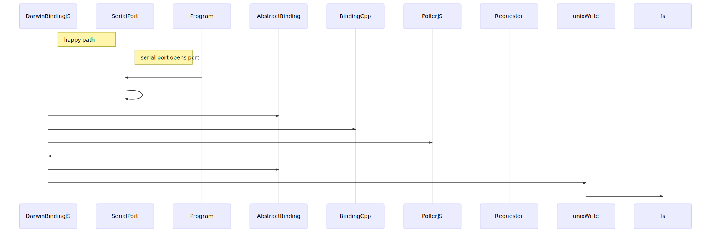
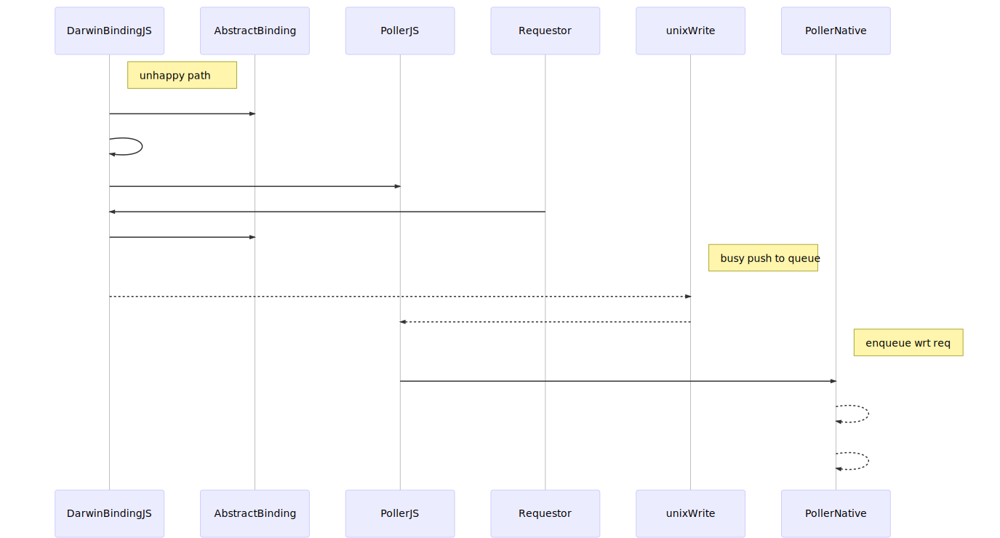

# @serialport/Bindings

The `Binding` is how Node-SerialPort talks to the underlying system. By default, we auto detect Windows, Linux and OS X, and load the appropriate module for your system. You can assign `SerialPort.Binding` to any binding you like. Find more by searching ["serialport-binding" at npm](https://www.npmjs.com/search?q=serialport-binding).

Learn more at our [bindings documentation](https://serialport.io/docs/api-bindings) page.

## Glenn's notes

The compiled cpp modules are 

| name | type |
|:------ |:------:|
| serialport.cpp | osx |
| serialport_unix.cpp | osx |
| poller.cpp | osx | 
| darwin_list.cpp | osx |

### entry

The index takes the process.platform and pulls in the darwin.js file. This exports the **DarwinBinding** 
which is an Abstract binding sub-class.

The **NAN** bindings take place in the serialport.cpp and from the definitions 
we have a **one-to-one** mapping with the AbstractBinding names. These are 

- Open
- Update
- Close
- Flush
- Set
- Get
- GetBaudRate
- Drain

It appears that severial helper functions are used essentially for each API name we have

- EIO_name(uv_work_t*)
- EIO_AfterName(uv_work_t*)

lets look at the Open method
looks like the call to the native layer takes
- string
- object
- callback

We create a Baton object **assuming the baton is just the data being passed around**. This essentially 
is a data object with lots of settings. What is interesting is the uv_work_t that is created and then 
queued.

The EIO_Open function is in the serialport_unix.cpp translation unit. It looks like the work is handed
off to the default event look. There is a call back given of EIO_AfterOpen. This is very interesting.

The unix EIO_Open takes the request which has a data pointer to the **baton**. It calls **open** from fncntl.h

After checking the arguements the **setup** function is called. **setup** is also in the serialport_unix.cpp 
translation unit.


## DarwinBinding

After the fd is opened the poller is created. This is a C++ class that calls the uv_poll_t() method
in order to create a poll type.

### Write case
A function by function step through of a call to write.



#### unhappy path



## Poller
The poller uses some of the uv lib [api](http://docs.libuv.org/en/v1.x/api.html)

- uv_poll_init
- uv_poll_start
- uv_poll_stop
- uv_close
- uv_default_loop

The Poller class is wrapped via Nan::ObjectWrap and is also derived from Nan::Async resource. So we need
to find the **NAPI** equivalents of 

- Nan::ObjectWrap
- Nan::AsyncResource

When requested to Poll the Poller will call uv_poll_start with a handler function of Poller::onData upon
the instance of the Poller in question.

When onData is **triggered** we call back. cNallback is triggered but what is callback. The **callback** is
set via the NAN_METHOD(Poller::New). What is the nature of the Nan::Callback ?

**answer** the callback is created via the Poller JS constructor and calls handleEvent bound to Poller JS object.js
It is this callback to handleEvent that emits the writeable. 

The current mechanism uses [lib uv](https://github.com/libuv/libuv) this shall be changed so that the **napi** 
[AsyncWorker](https://github.com/nodejs/node-addon-api/blob/master/doc/async_worker.md) is used instead. The 
mechanism will have to call poll directly in the work done rather than the [uv poll](http://docs.libuv.org/en/v1.x/poll.html).

Currently once the callback onData has been called then the poller is polled again, and the callback for the poller object
is called.

* * *

## appendix

The uv lib provided some file polling capabilities in the uv_poll_start functions which polled a file descriptor and called a uv_poll_callback when the uv_poll\_event changed 

```
enum uv_poll_event {
  UV_READABLE = 1,
  UV_WRITABLE = 2,
  UV_DISCONNECT = 4,
  UV_PRIORITIZED = 8
};
```
I am looking into converting an existing npm module [node-serialport](https://github.com/node-serialport/node-serialport) from **nan** to **napi**. 

This originally used the uv polling capabilities to check on the status in order to retry a **write** to a serial port. 

The **napi** does not provide such an interface as is available via **lib uv**. 

I am **seeking advice** on the best way forwards as it looks the the best to avoid the **lib uv dependency** is simple to replicate the code natively that does the polling in my module.


